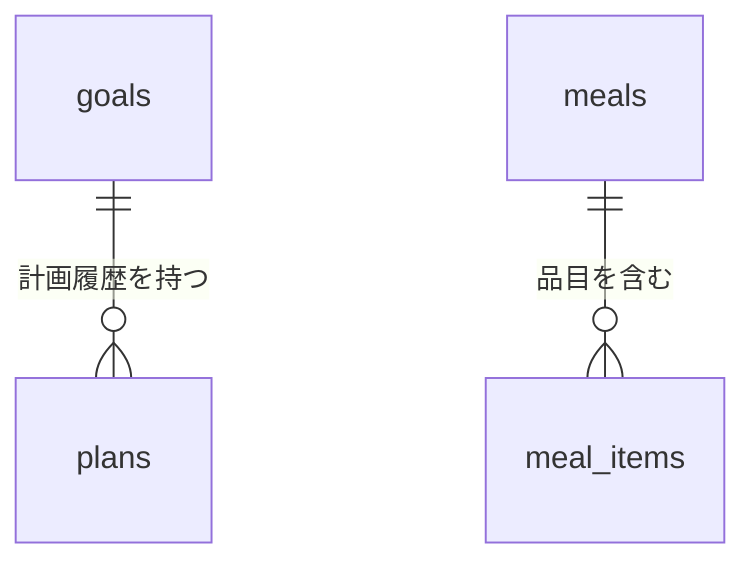

# データベーステーブル一覧

Diet Assistantが正式な記録として使用するSQLiteデータベースのテーブル定義です。
スキーマの正本は[`src/diet_assistant/db.py`](../src/diet_assistant/db.py)の
`SCHEMA_SQL`と`MIGRATIONS`であり、この文書はその内容を読みやすくまとめたものです。

- 現在のスキーマバージョン: `5`
- バージョン管理: `PRAGMA user_version`
- 外部キー制約: 接続ごとに`PRAGMA foreign_keys = ON`
- 日時: ISO 8601形式の`TEXT`。日時には原則としてタイムゾーンを含める
- 未記録の数値: `0`ではなく`NULL`
- 栄養素: カロリーはkcal、たんぱく質・脂質・炭水化物・食物繊維はg
- `sodium`: ナトリウム量ではなく食塩相当量（g）

プロフィールはこのDBには保存しません。`config/profile.json`を正本とし、
`src/diet_assistant/profile.schema.json`で検証します。

## 全体像

| テーブル | 役割 | 主な関連 |
| --- | --- | --- |
| `goals` | 体重目標と達成条件 | `plans`の親 |
| `plans` | 目標から計算した計画の履歴 | `goals.id`を参照 |
| `meals` | 1回の食事と栄養推定の合計 | `meal_items`の親 |
| `meal_items` | 食事に含まれる品目ごとの栄養推定 | `meals.id`を参照 |
| `exercises` | 有酸素運動・筋力トレーニングなどの記録 | 独立 |
| `body_metrics` | 体重・体脂肪率・胴囲の測定記録 | 独立 |
| `intake_entries` | inboxなど外部入力の受信・処理履歴 | 結果を種別とIDで論理参照 |
| `advice_history` | 日次・食後・期間助言の最新内容 | `meals.id`を参照（食後助言のみ） |

次のER図には、SQLiteの外部キーとして定義されている関連だけを示します。

`intake_entries.result_type`と`result_id`は処理結果を指す論理参照です。複数種別の結果を
扱えるように外部キーにはしていません。現在のinbox自動変換が作成する結果は食事だけです。

## `goals`

体重目標、期限、達成最低ライン、評価方法を保持します。有効な目標はDB全体で最大1件です。

| 列 | SQLite型 | NULL | 既定値 | 説明・制約 |
| --- | --- | --- | --- | --- |
| `id` | `INTEGER` | 不可 | 自動採番 | 主キー |
| `started_at` | `TEXT` | 不可 | なし | 目標の開始日または開始日時 |
| `target_date` | `TEXT` | 不可 | なし | 期限 |
| `start_weight` | `REAL` | 不可 | なし | 開始体重（kg）、`0`より大きい値 |
| `target_weight` | `REAL` | 不可 | なし | 挑戦目標体重（kg）、`0`より大きい値 |
| `success_threshold_weight` | `REAL` | 可 | `NULL` | 達成最低ライン（kg）、指定時は`0`より大きい値 |
| `evaluation_window_days` | `INTEGER` | 不可 | `1` | 評価に使う日数、`1`〜`28` |
| `target_type` | `TEXT` | 不可 | `weight_loss` | 目標種別。現在は主に`weight_loss`を使用 |
| `status` | `TEXT` | 不可 | `inactive` | `active`、`inactive`、`completed`、`cancelled`のいずれか |
| `note` | `TEXT` | 可 | `NULL` | 補足 |
| `created_at` | `TEXT` | 不可 | なし | 作成日時 |
| `deleted_at` | `TEXT` | 可 | `NULL` | 論理削除した日時。非`NULL`の目標は一覧・activate・評価から除外 |

インデックス:

- `one_active_goal`: `status = 'active'`だけを対象とする一意インデックス

`goal delete`は物理削除ではなく`deleted_at`を立てる論理削除です（[ADR 0009](adr/0009-goal-deletion-is-logical.md)）。
削除しても`plans`は残り、過去日のレポートはその計画を根拠として引き続き参照します。

## `plans`

目標に対して計算した摂取・運動計画を履歴として保持します。再計算時に既存の有効な計画は
`superseded`となり、新しい計画が`active`になります。

| 列 | SQLite型 | NULL | 既定値 | 説明・制約 |
| --- | --- | --- | --- | --- |
| `id` | `INTEGER` | 不可 | 自動採番 | 主キー |
| `goal_id` | `INTEGER` | 不可 | なし | `goals.id`への外部キー |
| `calculated_at` | `TEXT` | 不可 | なし | 計算日時 |
| `target_daily_calories` | `INTEGER` | 可 | `NULL` | 1日の摂取目標中心値（kcal） |
| `target_calorie_range_min` | `INTEGER` | 可 | `NULL` | 1日の摂取目標下限（kcal） |
| `target_calorie_range_max` | `INTEGER` | 可 | `NULL` | 1日の摂取目標上限（kcal） |
| `estimated_maintenance_calories` | `INTEGER` | 可 | `NULL` | 暫定維持カロリー（kcal/日） |
| `planned_daily_deficit` | `INTEGER` | 可 | `NULL` | 計画へ適用したエネルギー赤字（kcal/日） |
| `target_weekly_exercise_minutes` | `INTEGER` | 可 | `NULL` | 週間運動時間の目標（分） |
| `target_weekly_weight_change` | `REAL` | 不可 | なし | 週間体重変化の目標（kg/週）。減量は負数 |
| `protein_target` | `REAL` | 可 | `NULL` | たんぱく質目標（g/日）。現在は未計算 |
| `step_target` | `INTEGER` | 可 | `NULL` | 1日の歩数目標 |
| `assumptions` | `TEXT` | 不可 | なし | 計算上の仮定を格納するJSONオブジェクト |
| `weekly_actions` | `TEXT` | 不可 | `[]` | 週間行動を格納するJSON配列 |
| `safety_note` | `TEXT` | 可 | `NULL` | 安全上の注意 |
| `status` | `TEXT` | 不可 | `active` | `active`または`superseded` |

外部キーとインデックス:

- `goal_id` → `goals.id`。目標を削除すると関連する計画も削除される
- `plans_goal_id`: `goal_id`の通常インデックス

## `meals`

1回の食事について、時刻、区分、写真、栄養推定の合計を保持します。栄養値を推定できない
場合は`NULL`のまま保存します。

| 列 | SQLite型 | NULL | 既定値 | 説明・制約 |
| --- | --- | --- | --- | --- |
| `id` | `INTEGER` | 不可 | 自動採番 | 主キー |
| `eaten_at` | `TEXT` | 不可 | なし | 食べた日時 |
| `meal_type` | `TEXT` | 不可 | なし | `breakfast`、`lunch`、`dinner`、`snack`、`other`のいずれか |
| `note` | `TEXT` | 可 | `NULL` | 食事全体の説明・推定上の仮定 |
| `photo_path` | `TEXT` | 可 | `NULL` | 関連写真のローカルパス |
| `estimated_calories` | `REAL` | 可 | `NULL` | 代表推定値（kcal）、`0`以上 |
| `calories_min` | `REAL` | 可 | `NULL` | 推定下限（kcal）、`0`以上 |
| `calories_max` | `REAL` | 可 | `NULL` | 推定上限（kcal）、`0`以上 |
| `protein` | `REAL` | 可 | `NULL` | たんぱく質（g）、`0`以上 |
| `fat` | `REAL` | 可 | `NULL` | 脂質（g）、`0`以上 |
| `carbohydrates` | `REAL` | 可 | `NULL` | 炭水化物（g）、`0`以上 |
| `fiber` | `REAL` | 可 | `NULL` | 食物繊維（g）、`0`以上 |
| `sodium` | `REAL` | 可 | `NULL` | 食塩相当量（g）、`0`以上 |
| `estimation_confidence` | `TEXT` | 可 | `NULL` | 推定確信度。`low`、`medium`、`high`のいずれか |
| `source` | `TEXT` | 不可 | `manual` | 入力元 |
| `created_at` | `TEXT` | 不可 | なし | 作成日時 |
| `updated_at` | `TEXT` | 不可 | なし | 最終更新日時 |

カロリー範囲には次の整合性制約があります。

- 両端が記録されている場合は`calories_min <= calories_max`
- 代表値と下限が記録されている場合は`calories_min <= estimated_calories`
- 代表値と上限が記録されている場合は`estimated_calories <= calories_max`

インデックス:

- `meals_eaten_at`: `eaten_at`の通常インデックス

## `meal_items`

食事に含まれる料理・食品を品目単位で保持します。

| 列 | SQLite型 | NULL | 既定値 | 説明・制約 |
| --- | --- | --- | --- | --- |
| `id` | `INTEGER` | 不可 | 自動採番 | 主キー |
| `meal_id` | `INTEGER` | 不可 | なし | `meals.id`への外部キー |
| `name` | `TEXT` | 不可 | なし | 品目名 |
| `amount_text` | `TEXT` | 可 | `NULL` | 「1個」「茶碗1杯」などの申告・推定量 |
| `estimated_grams` | `REAL` | 可 | `NULL` | 推定重量（g）、`0`以上 |
| `estimated_calories` | `REAL` | 可 | `NULL` | 代表推定値（kcal）、`0`以上 |
| `calories_min` | `REAL` | 可 | `NULL` | 推定下限（kcal）、`0`以上 |
| `calories_max` | `REAL` | 可 | `NULL` | 推定上限（kcal）、`0`以上 |
| `protein` | `REAL` | 可 | `NULL` | たんぱく質（g）、`0`以上 |
| `fat` | `REAL` | 可 | `NULL` | 脂質（g）、`0`以上 |
| `carbohydrates` | `REAL` | 可 | `NULL` | 炭水化物（g）、`0`以上 |
| `fiber` | `REAL` | 可 | `NULL` | 食物繊維（g）、`0`以上 |
| `sodium` | `REAL` | 可 | `NULL` | 食塩相当量（g）、`0`以上 |
| `confidence` | `TEXT` | 可 | `NULL` | 品目の推定確信度。`low`、`medium`、`high`のいずれか |
| `note` | `TEXT` | 可 | `NULL` | 品目固有の補足・推定上の仮定 |

外部キー:

- `meal_id` → `meals.id`。食事を削除すると関連する品目も削除される

## `exercises`

運動の実施内容を保持します。種目に合わない列は`NULL`のまま保存できます。

| 列 | SQLite型 | NULL | 既定値 | 説明・制約 |
| --- | --- | --- | --- | --- |
| `id` | `INTEGER` | 不可 | 自動採番 | 主キー |
| `performed_at` | `TEXT` | 不可 | なし | 実施日時 |
| `exercise_type` | `TEXT` | 不可 | なし | 運動種別 |
| `duration_minutes` | `REAL` | 可 | `NULL` | 実施時間（分）、`0`以上 |
| `distance` | `REAL` | 可 | `NULL` | 距離（km）、`0`以上 |
| `sets` | `INTEGER` | 可 | `NULL` | セット数、`0`以上 |
| `repetitions` | `INTEGER` | 可 | `NULL` | 反復回数、`0`以上 |
| `weight` | `REAL` | 可 | `NULL` | 使用重量（kg）、`0`以上 |
| `intensity` | `TEXT` | 可 | `NULL` | 強度。現在は自由記述 |
| `estimated_calories_burned` | `REAL` | 可 | `NULL` | 推定消費カロリー（kcal）、`0`以上 |
| `note` | `TEXT` | 可 | `NULL` | 補足 |
| `source` | `TEXT` | 不可 | `manual` | 入力元 |
| `created_at` | `TEXT` | 不可 | なし | 作成日時 |
| `updated_at` | `TEXT` | 不可 | なし | 最終更新日時 |

インデックス:

- `exercises_performed_at`: `performed_at`の通常インデックス

## `body_metrics`

身体測定値を保持します。1行に一部の測定値だけを記録できます。

| 列 | SQLite型 | NULL | 既定値 | 説明・制約 |
| --- | --- | --- | --- | --- |
| `id` | `INTEGER` | 不可 | 自動採番 | 主キー |
| `measured_at` | `TEXT` | 不可 | なし | 測定日時 |
| `weight` | `REAL` | 可 | `NULL` | 体重（kg）、`0`より大きい値 |
| `body_fat_percentage` | `REAL` | 可 | `NULL` | 体脂肪率（%）、`0`〜`100` |
| `waist` | `REAL` | 可 | `NULL` | 胴囲（cm）、`0`より大きい値 |
| `note` | `TEXT` | 可 | `NULL` | 補足 |
| `created_at` | `TEXT` | 不可 | なし | 作成日時 |

インデックス:

- `metrics_measured_at`: `measured_at`の通常インデックス

## `intake_entries`

iPhoneショートカットなどから受け取った入力について、重複判定、元データ、処理状態、
処理結果を保持します。

| 列 | SQLite型 | NULL | 既定値 | 説明・制約 |
| --- | --- | --- | --- | --- |
| `id` | `INTEGER` | 不可 | 自動採番 | 主キー |
| `external_id` | `TEXT` | 不可 | なし | 入力元の識別子。DB全体で一意 |
| `occurred_at` | `TEXT` | 不可 | なし | 元の出来事が発生した日時 |
| `type` | `TEXT` | 不可 | なし | `meal`、`exercise`、`metric`のいずれか |
| `source` | `TEXT` | 不可 | なし | 入力元 |
| `raw_text` | `TEXT` | 可 | `NULL` | 入力に含まれる自由記述 |
| `raw_json` | `TEXT` | 不可 | なし | 元の入力を保持するJSONオブジェクト |
| `image_paths` | `TEXT` | 不可 | `[]` | 関連画像のローカルパスを保持するJSON配列 |
| `status` | `TEXT` | 不可 | なし | `pending`、`processing`、`completed`、`needs_review`、`failed`のいずれか |
| `error_message` | `TEXT` | 可 | `NULL` | 失敗理由 |
| `created_at` | `TEXT` | 不可 | なし | 受信日時 |
| `processed_at` | `TEXT` | 可 | `NULL` | 処理完了日時 |
| `result_type` | `TEXT` | 可 | `NULL` | 作成した記録の種別 |
| `result_id` | `INTEGER` | 可 | `NULL` | 作成した記録のID。外部キー制約は持たない |

インデックス:

- `external_id`: `UNIQUE`制約による一意インデックス
- `intake_status`: `status`の通常インデックス

## `advice_history`

生成した助言と、その根拠を保持します。同じ種別・期間（食後助言は同じ食事）の助言は
追記せず上書きするため、行数は「記録した日数 + 食事件数」の範囲に収まります。

| 列 | SQLite型 | NULL | 既定値 | 説明・制約 |
| --- | --- | --- | --- | --- |
| `id` | `INTEGER` | 不可 | 自動採番 | 主キー |
| `generated_at` | `TEXT` | 不可 | なし | 最後に生成した日時 |
| `advice_type` | `TEXT` | 不可 | なし | `daily`、`after_meal`、`7day`などの助言種別 |
| `meal_id` | `INTEGER` | 可 | なし | 食後助言の対象食事。`meals.id`を参照し、削除時は連動して消える |
| `period_start` | `TEXT` | 不可 | なし | 根拠期間の開始日 |
| `period_end` | `TEXT` | 不可 | なし | 根拠期間の終了日 |
| `summary` | `TEXT` | 不可 | なし | 状況の要約 |
| `details` | `TEXT` | 不可 | なし | 助言全体を保持するJSONオブジェクト |
| `evidence` | `TEXT` | 不可 | なし | 数値根拠を保持するJSONオブジェクト |
| `priority` | `TEXT` | 不可 | なし | 優先度。現在は`normal` |

一意キーは`(advice_type, period_start, period_end, COALESCE(meal_id, 0))`です
（索引`advice_history_key`）。

## 変更時の更新箇所

テーブルや列を変更するときは、次を同時に確認します。

1. 新規DB用の`src/diet_assistant/db.py`内`SCHEMA_SQL`
2. 既存DB用の同ファイル内`MIGRATIONS`と`SCHEMA_VERSION`
3. リポジトリ層・サービス層・CLIの読み書き
4. この文書と`docs/design.md`のDBスキーマ概要
5. マイグレーション、CRUD、制約のテスト
